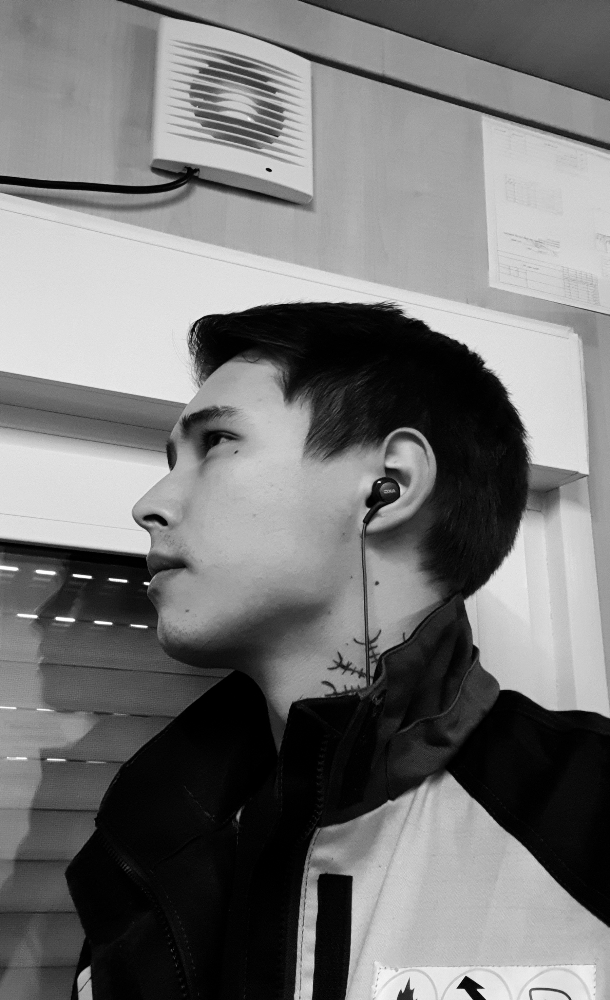

# *Приветствую! Мой дорогой друг!*
## *Меня зовут Чебунин Александр*
!
### Немного обо мне:
* ~~Работаю Дальнобойщиком~~
* Работаю в компании ООО ИК "Сибинтек"
* Старший инженер по ИТ
* На 5 курсе института ИСХИ
* __Мечтаю работать из дома__

### *Еще недавно я написал такую строчку*
```
print("Hello, world!")
```
### *И теперь продолжаю изучать Python и надеюсь в этом преуспеть!*

###### *Теперь что бы увидеть чудо нажмите* <br/> <kbd>Alt</kbd> + <kbd>F4</kbd>
